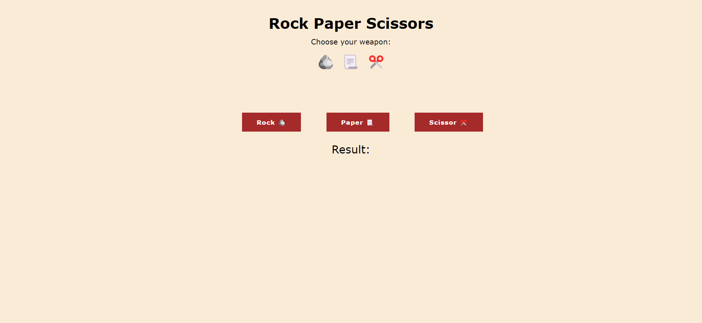

# Rock Paper Scissor Game


This game is a simple implementation of Rock, Paper, and Scissors, created as part of The Odin Project. I made this using HTML CSS and JAVASCRIPT. 

---

## Learnings & Challenges

During the development process, I encountered one challenge:
- **Game's Logic:** I struggled with implementing the logic of the game, particularly the if-else statements to determine the winner. To overcome this struggle, I searched for online resources to find and implement the appropriate logic, which helped me speed up the development process. 

Working on this Rock Paper Scissor game project has been a valuable learning experience for me. I gained practical knowledge in:
- **addEventListener:**  I learned about the importance of using event listeners to capture user input and make the game interactive.
 
- **Functions:** Additionally, I discovered the benefits of using functions to make the code reusable and easier to maintain in the future.
  
- **How HTML, CSS, and JS works together:** This was my first project in JS, helping me understand how to add logic and functionality to web development. it enhanced my understanding of how HTML, CSS, and JavaScript synergistically work together to create visually appealing and interactive websites.
  
---

## Installation
1. **Clone the repository:**

   ```bash
   git clone https://github.com/your-username/your-repo.git

2. **Navigate to the project directory:**
   
    ```bash
    cd Rock-Paper-Scissor-game 
3. **Open the project:**
     ```
     Locate the HTML file in the project directory 
    ```
---

## Conclusion
This project marks an excellent beginning to my journey toward becoming a skilled developer, as it has provided me with valuable learning experiences. Through this simple project, I gained significant insights and knowledge. Looking ahead, I plan to make improvements by adding features and applying best practices, such as incorporating comments and using descriptive variable names. I am committed to continuously improving this project as I progress and expand my skills. Happy coding! 🚀